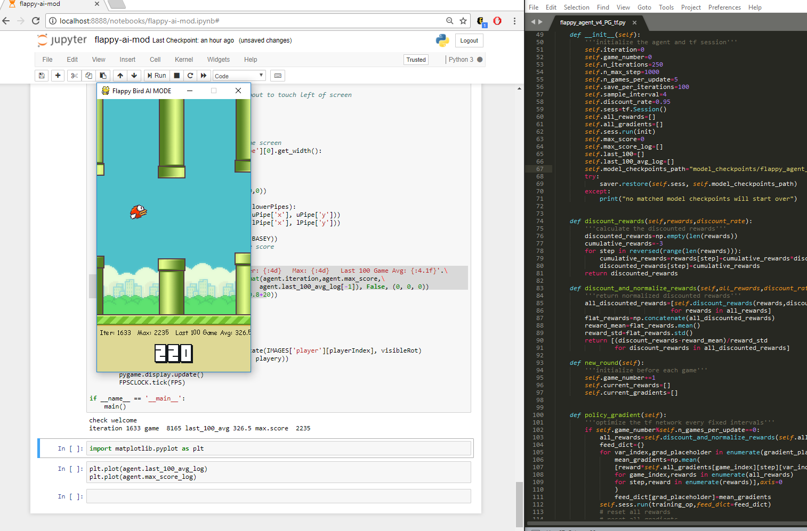

FlappyBird AI 
===============

When Flappy Bird (Pygame) [pygame.org] Meets Machine Learning

Requirements
------

1. Install Python 3.5.x from [here](https://www.python.org/download/releases/)

2. Install PyGame 1.9.X from [here](http://www.pygame.org/download.shtml)

3. In command line type pip install -r requirements-cpu.txt (requirements-gpu.txt if you are using a tensorflow-gpu environment)
----------

Modifications made to the original Flappy Bird version [pygame flappy bird]
------

* limit the bird color to red
* limit the background to background-day.png
* limit the pipe color to green
* remove all the sound effects
* show the score at the bottom to minimize its impact
* base does not shift anymore
* K_a to enter AI mode while K_UP or K_SPACE to enter manual mode
* add statistic info at the bottom of the screen

----------

[1]: http://www.pygame.org
[2]: https://github.com/sourabhv/FlapPyBird

